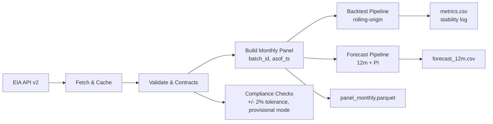

# FIRE � Fuel Integrity & Reconciliation Engine

**A compliance-focused, revision-aware pipeline for forecasting US pipeline compressor fuel consumption (FERC Account 820)**


## Why It Matters

**For Accounting & Compliance Teams:**
- **FERC Account 820**: Direct support for pipeline compressor fuel expense reporting requirements
- **ASC 980 Compliance**: Probable recovery assessment and regulatory asset recognition for fuel surcharges
- **GAAP Alignment**: Immutable audit trail with complete data lineage for financial reporting
- **Form 2/3-Q Bridge**: Monthly data supports quarterly regulatory reporting with variance analysis
- **Cross-Account Integration**: Supports Accounts 182.3/254 for under/over-recovery tracking

**For Cross-Functional Teams:**
- **Measurement Teams**: Accurate fuel consumption forecasting for operational planning
- **Scheduling Teams**: Reliable fuel cost projections for capacity planning
- **Accounting Teams**: Automated reconciliation and variance analysis workflows
- **Regulatory Teams**: Compliance-ready data for FERC reporting and rate case support
- **Single Source of Truth**: Eliminates guesswork in fuel consumption forecasting
- **Revision-Aware**: Never lose historical data; complete audit trail for all changes

## Features

### Revision-Aware Lineage
- **Batch Tracking**: Every data update creates new `batch_id` with UTC timestamp
- **Append-Only**: New revisions as PTAs (Point-in-Time Archives); never overwrites
- **Frozen Backtests**: Each data vintage preserved for reproducible validation
- **State Idempotence**: Same source snapshot -> same outputs; new snapshot -> new batch

### Data Integrity & Controls
- **+/-2% Tolerance**: Automated validation vs EIA source snapshots
- **Provisional Mode**: Blocks publishing when upstream stale >3 business days
- **Exception Flagging**: Out-of-tolerance data automatically flagged for review
- **Cache Management**: 3-day business day TTL with staleness detection

### Modeling Portfolio
- **Seasonal-Naive**: Baseline model for performance benchmarking
- **STL+ETS**: Seasonal-Trend decomposition with Exponential Smoothing
- **SARIMAX**: ARIMA with exogenous variables (HDD/CDD, Henry Hub)
- **Rolling Backtest**: 60-month lookback, 12-month horizon validation

### Compliance & Auditability
- **FERC Alignment**: Designed for Account 820 reporting requirements
- **ASC 980 Compliance**: Probable recovery assessment for fuel surcharge recognition
- **Cross-Account Support**: Integration with Accounts 182.3/254 for under/over-recovery
- **Audit Trail**: Complete lineage logging in JSONL format
- **Tie-out Process**: Monthly variance analysis with escalation paths
- **Retention Policy**: 24 months full data; quarterly snapshots beyond
- **CPA Certification**: Audit-ready documentation for external review

### ASC 980 Compliance

FIRE explicitly supports recognition of regulatory assets and liabilities in accordance with ASC 980, *Regulated Operations*. The system is designed to mirror the requirements of cost-of-service regulation:

- **Scope Criteria (ASC 980-10-15):**
  - Rates are set or approved by an authorized regulator or governing board.
  - Rates are cost-based and intended to recover allowable operating costs.
  - Rates are collectible from customers at levels that will recover the allowable costs.

- **Regulatory Assets (Account 182.3, ASC 980-340):**
  - Under-recovered fuel costs are recognized as regulatory assets when recovery is probable.
  - Such costs are amortized over recovery periods and written down if recovery is no longer probable.
  - Carrying charges may include debt cost of capital, but not equity return.

- **Regulatory Liabilities (Account 254, ASC 980-405):**
  - Over-recovered fuel costs or probable future refunds are recognized as regulatory liabilities.
  - Liabilities are reversed when refunded or offset in future rate periods.

- **Fuel Cost Tracker Mechanism:**
  - FIRE's variance logging (+/- 2% tolerance) is designed to support fuel cost trackers/true-ups, a common regulatory mechanism explicitly contemplated by ASC 980.

## Quickstart

### Prerequisites
- Python 3.11+
- EIA API key ([Get one here](https://www.eia.gov/opendata/register.php))

### Installation
```bash
# Clone and install
git clone <repository-url>
cd fuel-tracker
pip install -e .

# Or with conda (recommended for Windows)
conda install -y -c conda-forge python=3.11 ruff pytest pre-commit detect-secrets
python -m pip install -r requirements.txt
```

### Environment Setup
```bash
# Set your EIA API key
export EIA_API_KEY=your_api_key_here

# Or create .env file
echo "EIA_API_KEY=your_api_key_here" > .env
```

### Run the Pipeline
```bash
# PowerShell (Windows)
.\run.ps1 all

# Or individual commands
.\run.ps1 pull        # Fetch data & build panel
.\run.ps1 backtest    # Run baseline backtest
.\run.ps1 forecast    # Generate 12-month forecast
.\run.ps1 status      # Check output status

# Python modules (cross-platform)
python -m fueltracker.pipeline.fetch_and_build --dry-run
python -m fueltracker.run_backtest --model baseline --horizon 12
python -m fueltracker.forecast --model baseline --horizon 12
```

## Outputs

| File | Description | Format |
|------|-------------|---------|
| `outputs/panel_monthly.parquet` | Tidy monthly panel with lineage columns | Parquet |
| `outputs/metrics.csv` | Rolling-origin backtest metrics + stability flags | CSV |
| `outputs/forecast_12m.csv` | 12-month forecast with prediction intervals | CSV |
| `MODEL_CARD.md` | Living model documentation and assumptions | Markdown |

## Data Contracts

### Panel Schema
| Column | Type | Description |
|--------|------|-------------|
| `period` | date | Month-end date (YYYY-MM-DD) |
| `value_mmcf` | float | Fuel consumption in million cubic feet |
| `metric` | string | Always "pipeline_compressor_fuel" |
| `freq` | string | Always "monthly" |
| `batch_id` | UUID | Unique batch identifier for lineage |
| `asof_ts` | datetime | UTC timestamp when data was processed |

### Lineage Rules
- **No Overwrites**: Previous data vintages preserved for auditability
- **Batch Tracking**: Each update creates new batch with UUID and timestamp
- **Frozen Panels**: Backtests use data vintage at specific timestamp
- **State Idempotence**: Same source -> same outputs; new source -> new batch

## Modeling & Backtesting

### Model Portfolio
1. **Seasonal-Naive**: Simple seasonal pattern replication (baseline)
2. **STL+ETS**: Seasonal-Trend decomposition with Exponential Smoothing
3. **SARIMAX**: ARIMA with exogenous variables (HDD/CDD, Henry Hub)

### Exogenous Features
- **HDD/CDD**: Population-weighted heating/cooling degree days
- **Henry Hub**: Monthly average natural gas spot price
- **Seasonality**: 12-month seasonal patterns

### Backtest Protocol
- **Method**: Rolling-origin with frozen panels per data vintage
- **Window**: 60 months lookback, 12 months horizon
- **Metrics**: MAE, sMAPE, RMSE, MAPE
- **Success Criteria**: Beat Seasonal-Naive by >=10% median MAE/sMAPE
- **Stability Tracking**: Alert when top model flips >=N times across M revisions

## Compliance & Controls

### Tolerance Rules
- **Source Validation**: +/-2% variance vs EIA source snapshot
- **Exception Handling**: Out-of-tolerance data flagged for review
- **Provisional Mode**: Blocks publishing when cache stale >3 business days

### Tie-out Process
- **Monthly**: Variance analysis with +/-2% tolerance
- **Quarterly**: Form 2/3-Q bridge with escalation paths
- **Annual**: Full compliance audit and system review
- **CPA Review**: External audit documentation and certification
- **ASC 980 Assessment**: Probable recovery evaluation for regulatory assets

### Quick-Reference Journal Entries (illustrative)
- **Record compressor fuel expense (Acct 820)**
  - Dr 820 Pipeline compressor fuel expense
  - Cr 131/Inventory or 232/AP (as applicable)

- **Record fuel retainage revenue (Acct 489)**
  - Dr 142/AR (or clearing)
  - Cr 489 Transportation revenue - fuel retainage

- **Under-recovery (regulatory asset, Acct 182.3)**
  - Dr 182.3 Regulatory asset - fuel under-recovery
  - Cr 489 Transportation revenue - fuel retainage (or 254 reversal on settlement)

- **Over-recovery (regulatory liability, Acct 254)**
  - Dr 489 Transportation revenue - fuel retainage (or 182.3 reversal on settlement)
  - Cr 254 Regulatory liability - fuel over-recovery

> **Variance & Escalation**
> - If |Actual - Source| / Source > **2%** at monthly tie-out:
>   1) Re-pull snapshot & rerun panel for same `asof_ts`
>   2) If variance persists -> open "Fuel Variance" ticket with artifacts:
>      - Source snapshot metadata, `batch_id`, `asof_ts`
>      - Diff excerpt (by month) and top drivers
>   3) Mark run **provisional** and **do not publish** until resolved

### Revision Management
- **Append-Only**: New revisions as PTAs; never overwrites
- **Retention**: 24 months full data; quarterly snapshots beyond
- **Audit Trail**: Complete lineage logging in JSONL format

## Architecture



*See [docs/architecture.md](docs/architecture.md) for detailed system design.*

## CLI Examples

### End-to-End Pipeline
```bash
# Fresh monthly build
.\run.ps1 all

# Check status
.\run.ps1 status
```

### Backtest Only
```bash
# Run baseline backtest
python -m fueltracker.run_backtest --model baseline --horizon 12 --last-n-months 60

# Run with specific cutoff date
python -m fueltracker.run_backtest --asof 2024-01-01T00:00:00Z --model sarimax
```

### Forecast Only
```bash
# Generate 12-month forecast
python -m fueltracker.forecast --model baseline --horizon 12

# Auto-select winning model
python -m fueltracker.forecast --horizon 12
```

### Data Pipeline
```bash
# Fetch and build panel
python -m fueltracker.pipeline.fetch_and_build

# Dry run (no files written)
python -m fueltracker.pipeline.fetch_and_build --dry-run
```

## Ops Runbook

### If Upstream Fails
1. Check EIA API status and connectivity
2. Verify `EIA_API_KEY` environment variable
3. Review cache staleness (`data/cache/last_success.json`)
4. Enable provisional mode if cache stale >3 business days

### If Variance >2%
1. Review source data changes in EIA API
2. Check for data quality issues or API changes
3. Escalate to data team for investigation
4. Document findings in lineage log

### Regenerate Prior Vintage
```bash
# Use specific cutoff date for frozen panel
python -m fueltracker.run_backtest --asof 2024-01-01T00:00:00Z
python -m fueltracker.forecast --asof 2024-01-01T00:00:00Z
```

## Roadmap

### Phase 2
- **Under/Over-Recovery Bridge**: Integration with Accounts 182.3/254
- **Enhanced Monitoring**: Real-time dashboard and alerting
- **API Improvements**: Rate limiting and retry logic

### Future Enhancements
- **Distribution Granularity**: Regional and pipeline-specific forecasting
- **Advanced Models**: Deep learning and ensemble methods
- **Integration**: FlowCal/Quorum API connectors

## Contributing

### Development Setup
```bash
# Install dev dependencies
pip install -e ".[dev]"

# Run linting
ruff check .

# Run tests
pytest -q

# Pre-commit hooks
pre-commit install
```

### Code Style
- **Linting**: Ruff for code quality and formatting
- **Testing**: pytest for unit and integration tests
- **Security**: detect-secrets for credential scanning
- **Commits**: Conventional commit messages

## License

MIT License - see [LICENSE](LICENSE) for details.

---

**Questions?** Check the [Model Card](MODEL_CARD.md) for detailed assumptions and limitations, or review the [Architecture Guide](docs/architecture.md) for system design details.

## Vision
- See docs/vision/FIRE-ecosystem-brief.md for the one-pager covering FIRE, the CompressionSight analytics lens, and The Compliance Curve governance frame.
- Review docs/qptm_agv_validation.md for the QPTM Allocation Governance & Validation (AGV) read-only ML validator.

---

Formerly: �Fuel Tracker� (no functional changes in this release)
