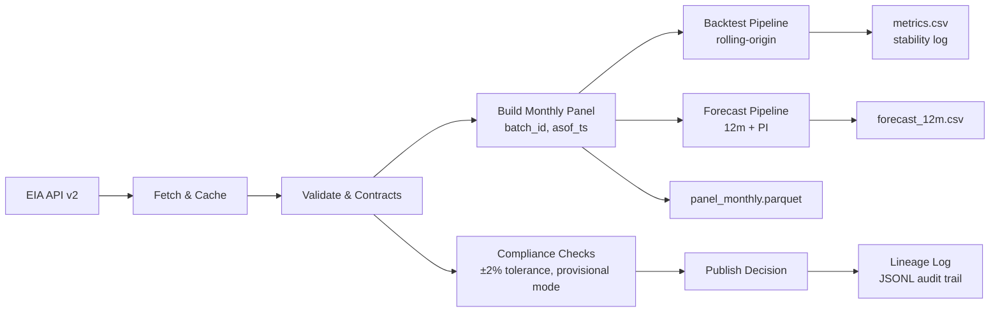

# Fuel Tracker Architecture

## Overview
The Fuel Tracker system is designed as a compliance-focused, revision-aware data pipeline for forecasting US pipeline compressor fuel consumption. The architecture emphasizes auditability, reproducibility, and regulatory compliance for FERC Account 820 reporting.

## System Architecture



## Core Components

### 1. Data Ingestion Layer
- **EIA Client** (`eia_client.py`): Handles API communication with EIA v2
- **Cache Management** (`cache.py`): Implements 3-day business day TTL
- **Endpoint Configuration** (`config/eia_endpoints.yml`): Parameterized API endpoints

### 2. Data Processing Layer
- **Panel Builder** (`panel.py`): Transforms raw data into standardized monthly panel
- **Schema Validation** (`contracts.py`): Pydantic v2 models for data integrity
- **Lineage Tracking** (`lineage.py`): UUID-based batch tracking with timestamps

### 3. Modeling Layer
- **Baseline Model** (`models/baseline.py`): Seasonal-Naïve forecasting
- **STL+ETS Model** (`models/stl_ets.py`): Seasonal-Trend decomposition
- **SARIMAX Model** (`models/sarimax.py`): ARIMA with exogenous variables

### 4. Backtesting & Forecasting
- **Backtest Engine** (`backtest.py`): Rolling-origin validation with frozen panels
- **Forecast Engine** (`forecast.py`): 12-month forecasting with prediction intervals
- **Model Selection**: Performance-based winner selection

### 5. Compliance & Controls
- **Provisional Mode** (`provisional.py`): Blocks publishing when cache stale
- **Tolerance Validation**: ±2% variance checking vs source
- **Audit Trail**: Complete lineage logging in JSONL format

## Data Flow

### Monthly Pipeline Execution
1. **Data Fetch**: EIA API → Cache validation → Raw data retrieval
2. **Schema Mapping**: Raw data → MonthlyFuelRow schema with lineage
3. **Panel Building**: Standardized monthly panel with batch metadata
4. **Compliance Check**: Tolerance validation and provisional mode check
5. **Backtesting**: Rolling-origin validation on frozen data vintage
6. **Forecasting**: 12-month forecast with prediction intervals
7. **Output Generation**: Parquet panel, CSV metrics, CSV forecast
8. **Lineage Logging**: Complete audit trail in JSONL format

### Revision Management
- **Append-Only**: New data creates new batch, never overwrites
- **Frozen Panels**: Backtests use data vintage at specific timestamp
- **State Idempotence**: Same source → same outputs; new source → new batch
- **Rollback Capability**: Previous forecasts preserved in lineage

## Data Contracts

### Panel Schema (MonthlyFuelRow)
```python
{
    "period": date,           # Month-end date
    "value_mmcf": float,      # Fuel consumption in MMcf
    "metric": "pipeline_compressor_fuel",
    "freq": "monthly",
    "lineage": BatchMeta      # batch_id, asof_ts, source, notes
}
```

### Batch Metadata (BatchMeta)
```python
{
    "batch_id": UUID,         # Unique batch identifier
    "asof_ts": datetime,      # UTC timestamp
    "source": "EIA|BACKTEST|FORECAST",
    "notes": str              # Optional batch description
}
```

## Configuration Management

### Environment Variables
- `EIA_API_KEY`: Required for EIA API access
- `CACHE_TTL_BUSINESS_DAYS`: Cache staleness threshold (default: 3)

### Configuration Files
- `config/eia_endpoints.yml`: API endpoint configurations
- `pyproject.toml`: Project metadata and dependencies
- `requirements.txt`: Python package dependencies

## Output Artifacts

### Primary Outputs
- **`panel_monthly.parquet`**: Tidy monthly panel with lineage columns
- **`metrics.csv`**: Rolling-origin backtest metrics + stability flags
- **`forecast_12m.csv`**: 12-month forecast with prediction intervals
- **`MODEL_CARD.md`**: Living model documentation

### Audit Artifacts
- **`lineage_log.jsonl`**: Complete batch history and metadata
- **`last_success.json`**: Cache freshness tracking
- **Console logs**: Structured logging with batch context

## Compliance Features

### FERC Account 820 Alignment
- Monthly fuel consumption data for pipeline compressor operations
- Audit trail supporting regulatory reporting requirements
- Variance tolerance controls for data quality assurance

### GAAP Compliance
- Immutable data lineage with timestamp tracking
- Append-only revision policy prevents data loss
- Complete audit trail for financial reporting

### Data Quality Controls
- ±2% tolerance validation vs source data
- Provisional mode blocking during data staleness
- Automated exception flagging for out-of-tolerance data

## Security & Hardening

### Data Protection
- **API Key Management**: Environment variables with secure storage
- **No Hardcoded Credentials**: All secrets managed through environment
- **Secure Logging**: Structured logging without sensitive data exposure
- **Data Encryption**: Parquet files with column-level encryption support
- **Access Controls**: Role-based access to sensitive financial data

### Audit Security
- **Immutable Lineage**: JSONL logs with cryptographic integrity checks
- **UUID-based Tracking**: Unique batch identifiers prevent collision attacks
- **Timestamp Validation**: UTC timestamps with timezone validation
- **Digital Signatures**: Batch metadata includes integrity verification
- **Tamper Detection**: Log integrity monitoring and alerting

### Compliance Security
- **FERC Compliance**: Data handling meets regulatory security requirements
- **SOX Compliance**: Audit trail supports Sarbanes-Oxley requirements
- **ASC 980 Security**: Financial data protection for regulatory reporting
- **CPA Audit Trail**: External auditor access controls and documentation

### Compliance Flow (ASC 980)

```mermaid
flowchart TD
  A[Fuel Variance > 2%] --> B[True-up Analysis]
  B --> C{Under vs Over Recovery?}
  C -->|Under| D[Recognize Regulatory Asset (182.3)]
  C -->|Over| E[Recognize Regulatory Liability (254)]
  D --> F[Disclosure: Probable Recovery per ASC 980-340]
  E --> G[Disclosure: Probable Refund per ASC 980-405]
  F & G --> H[Regulatory Reporting (Form 2 / 3-Q)]
```

* **Controls:**
  * Variance detection triggers provisional mode until resolved.
  * Management reassesses ASC 980 scope criteria annually.
  * Cross-team sign-off (Measurement → Scheduling → Accounting → Regulatory) ensures GAAP/FERC tie-out.

## Monitoring & Operations

### Health Checks
- Cache freshness validation
- API connectivity monitoring
- Data quality tolerance checking
- Provisional mode status tracking

### Alerting
- Variance threshold breaches
- Cache staleness warnings
- API failure notifications
- Model performance degradation

### Maintenance
- **Monthly Pipeline**: Automated data fetch and panel building
- **Quarterly Review**: Model performance and selection updates
- **Annual Audit**: Full system review and compliance check
- **CPA Certification**: External audit documentation and review
- **Continuous Monitoring**: Real-time alerting and health checks

### Retention & Archival
- **Full Data Retention**: 24 months of complete backtest and forecast data
- **Quarterly Archives**: Compressed quarterly snapshots beyond 24 months
- **Lineage Log Retention**: Permanent retention of all batch metadata
- **Audit Trail**: 7-year retention for regulatory compliance
- **Data Purging**: Automated cleanup of temporary and cache files

## Technology Stack

### Core Dependencies
- **Python 3.11+**: Runtime environment
- **pandas**: Data manipulation and analysis
- **numpy**: Numerical computing
- **statsmodels**: Statistical modeling
- **pydantic v2**: Data validation and contracts
- **pyarrow**: Parquet file format support

### Development Tools
- **ruff**: Code linting and formatting
- **pytest**: Testing framework
- **pre-commit**: Git hooks for quality control
- **detect-secrets**: Security scanning

### Infrastructure
- **Git**: Version control and change tracking
- **Parquet**: Columnar data storage format
- **JSONL**: Lineage log format
- **YAML**: Configuration management

## Scalability Considerations

### Performance
- **Columnar Storage**: Parquet format for efficient data access and compression
- **Rolling Backtest**: Configurable windows for computational efficiency
- **Caching Strategy**: Multi-tier caching to minimize API calls
- **Parallel Processing**: Concurrent model training and validation
- **Memory Management**: Efficient data structures for large datasets

### Extensibility
- **Modular Architecture**: Easy addition of new forecasting methods
- **Configurable Endpoints**: Support for multiple data sources
- **Pluggable Validation**: Customizable compliance rules per requirement
- **API Extensions**: RESTful interfaces for external system integration
- **Model Registry**: Versioned model storage and deployment

### Maintenance
- **Automated Testing**: Comprehensive test suite with CI/CD integration
- **Structured Logging**: Centralized logging with correlation IDs
- **Clear Separation**: Modular design for easier maintenance
- **Documentation**: Living documentation with automated updates
- **Monitoring**: Real-time system health and performance metrics

## Compliance & Regulatory Considerations

### FERC Compliance
- **Account 820**: Pipeline compressor fuel expense reporting
- **Form 2/3-Q**: Quarterly regulatory reporting support
- **Rate Case Support**: Historical data for rate case filings
- **Audit Trail**: Complete lineage for regulatory review

### ASC 980 Compliance
- **Probable Recovery**: Assessment of fuel cost recovery probability
- **Regulatory Assets**: Under-recovery recognition and tracking
- **Regulatory Liabilities**: Over-recovery recognition and tracking
- **Variance Analysis**: Monthly reconciliation for compliance

### SOX Compliance
- **Internal Controls**: Automated validation and exception handling
- **Audit Documentation**: Complete audit trail for external review
- **Change Management**: Version control and approval workflows
- **Risk Management**: Automated risk assessment and mitigation
