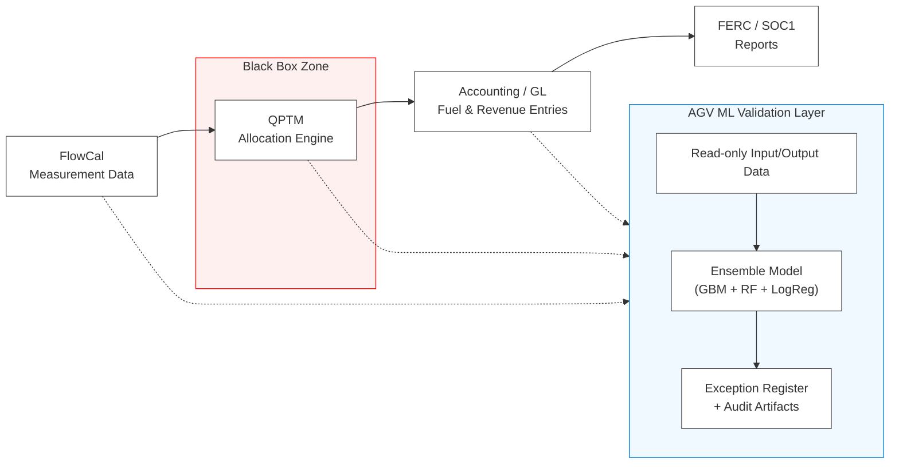

# QPTM Allocation Governance & Validation (AGV)

## 1. Purpose
This document defines the QPTM Allocation Governance & Validation (AGV) framework - a
non-operational, machine-learning validation layer designed to evaluate the consistency,
transparency, and audit readiness of Quorum Pipeline Transportation Management (QPTM)
allocation logic. AGV establishes evidence-based assurance of rule-driven behavior without
access to proprietary system logic.

## 2. Governance Context
| Framework | Contribution |
|---|---|
| MVDG | Adds governance only where opacity exists, keeping controls lean. |
| DLGI | Turns exceptions and explainability metrics into readable artifacts. |
| SOC 1 | Supports: "system-generated allocations are consistent and complete." |
| Ethical AI | Read-only validation; no operational decisioning; no source code access. |

## 3. Architecture Overview

**Notes:** Red = opaque logic zone. Blue = AGV visibility. Dashed = read-only feeds.

## 4. Model Design Summary

| Layer               | Function               | Key Metric                   |
| ------------------- | ---------------------- | ---------------------------- |
| Gradient Boosting   | Primary rule inference | R^2 / MAE                    |
| Random Forest       | Robustness check       | Feature importance stability |
| Logistic Regression | Interpretability layer | Explainability index         |
| Error Analysis      | Rule deviation scoring | Exception rate %             |

* Explainability: SHAP
* Grain: allocation line per shipper-nomination-contract-service-charge
* Validation: quarterly or on QPTM version change

## 5. Exception Management & Audit Artifacts

| Artifact             | Description                             | Owner           |
| -------------------- | --------------------------------------- | --------------- |
| Exception Register   | High-error or low-explainability cases  | Controls Lead   |
| Scenario Deck        | High/low accuracy with business context | Audit Analytics |
| Rule Consistency Map | Inferred dominant logic branches        | Compliance      |
| Model Fact Sheet     | Inputs, metrics, versions, governance   | Data Science    |

Workflow: flag -> classify -> resolve -> retain as SOC 1 evidence.

## 6. Governance Integration

| Loop            | Description                             | Frequency |
| --------------- | --------------------------------------- | --------- |
| Audit Loop      | Share results with IA/external auditors | Quarterly |
| Governance Loop | Feed exceptions into process docs       | As needed |
| Knowledge Loop  | Use failures for training/updates       | Ongoing   |

## 7. Future Roadmap

| Phase   | Objective                                                      |
| ------- | -------------------------------------------------------------- |
| Phase 2 | Integrate AGV results into Fuel Tracker lineage panel.         |
| Phase 3 | Promote to standalone package `qptm-agv` with CI and registry. |

## 8. References

* QPTM Allocation Process Governance and Control Validation
* QPTM AGV Feasibility
* Fuel_Consumption_SOP; Implementation Draft
* MVDG Charter; DLGI Vision Framework

## 9. Footer

Document Path: /docs/qptm_agv_validation.md
Encoding: UTF-8 (no BOM)
Line Endings: LF
Maintainer: Finance Systems & Data Analytics
